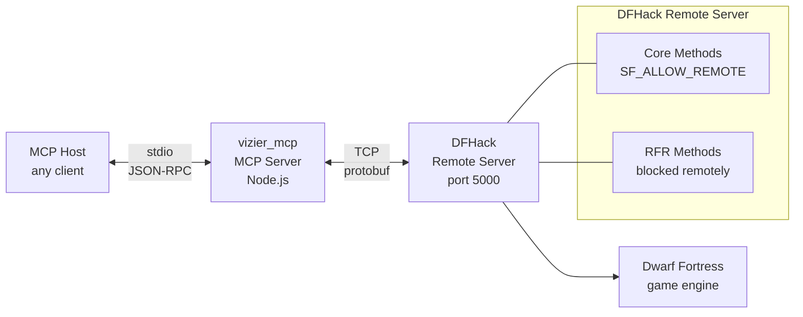

# Vizier MCP

MCP server for querying Dwarf Fortress game state via DFHack's remote API.

## Architecture



## Setup

```bash
npm install
npm run build
```

## MCP Host Configuration (OpenCode)

```jsonc
{
  "mcp": {
    "vizier": {
      "type": "local",
      "command": ["node", "/path/to/vizier_mcp/build/index.js"],
      "enabled": true,
      "environment": {
        "DFHACK_HOST": "127.0.0.1",
        "DFHACK_PORT": "5000"
      }
    }
  }
}
```

## Tools

### Working (Core API)

| Tool | Description | Key Inputs |
|------|-------------|------------|
| `get_version` | DFHack version string | — |
| `get_df_version` | Dwarf Fortress version string | — |
| `get_world_info` | World name, game mode, world ID | — |
| `list_enums` | All enum definitions | — |
| `list_job_skills` | Skills, professions, and labors | `type`, `offset`, `limit` |
| `list_materials` | Material definitions | `builtin`, `inorganic`, `creatures`, `plants`, `offset`, `limit` |
| `list_units` | Units with filters, data mask, and name resolution | `scan_all`, `race`, `civ_id`, `name`, `mask`, `offset`, `limit` |
| `list_squads` | Military squads and members | — |
| `set_unit_labors` | Enable/disable labors per unit | `changes[]` |

### `list_units` Mask Options

When `mask` is set, the response includes resolved human-readable names from DFHack's internal enums:

```json
{
  "profession": 114,
  "professionName": "Bard",
  "skills": [{ "id": 117, "level": 8, "name": "Music", "nameNoun": "Musician" }],
  "labors": [{ "id": 11, "name": "Carpentry" }]
}
```

| Mask Field | What It Returns | Names Added |
|-----------|----------------|-------------|
| `profession` | Profession enum, squad assignment | `professionName` |
| `skills` | Skill levels and experience | `name`, `nameNoun` per skill |
| `labors` | Enabled labors as `{ id, name }` objects | `name` per labor |
| `miscTraits` | Personality trait values | — |

All names are fetched dynamically from the connected DFHack instance at runtime — they adapt to the running DF version.

### Name Search

`list_units` supports a `name` parameter for client-side substring search, matching on first name, last name, English name, and nickname (case-insensitive):

```
list_units({ scan_all: true, name: "besmar", mask: { profession: true } })
```

### Pagination

`list_units`, `list_materials`, and `list_job_skills` support `offset`/`limit`:

```json
{ "total": 174, "offset": 0, "limit": 20, "items": [...] }
```

### Blocked Methods

All RemoteFortressReader (RFR) methods and the core `RunLua`/`RunCommand` are blocked for remote connections. DFHack's `RemoteServer.cpp` checks a per-method `SF_ALLOW_REMOTE` flag — methods without it are rejected for non-localhost clients. Fixing this requires a DFHack source change or a proxy on the DF host.

| Method | Provides | Status |
|--------|----------|--------|
| `GetUnitList` | Full unit data with current job | Blocked |
| `GetBlockList` | Map tile/terrain data | Blocked |
| `GetMapInfo` | Map dimensions | Blocked |
| `GetPauseState` | Game pause state | Blocked |
| `GetBuildingDefList` | Building definitions | Blocked |
| `GetCreatureRaws` | Creature definitions | Blocked |
| `GetPlantRaws` | Plant definitions | Blocked |
| `GetTiletypeList` | Tile types | Blocked |
| `RunLua` | Arbitrary Lua queries | Blocked |
| `RunCommand` | DFHack console commands | Blocked |

## What the Remote Server Exposes

| Available via Core API | Not Available Remotely |
|------------------------|------------------------|
| Version strings (DF + DFHack) | Map tile/block data |
| World name, game mode, world ID | Unit current jobs and activity |
| Unit names, positions, races, civ | Unit health, injuries, mood, stress |
| Profession with human-readable names | Noble titles (entity positions) |
| Skill levels and experience | Equipment and inventory |
| Enabled labors per unit | Relationships and family |
| Personality traits | Burrow assignments |
| Military squad rosters | Game pause state |
| All material definitions | Building/item/creature/plant defs |
| Enum definitions (labors, skills, etc.) | Lua queries (`RunLua`) |
| Name search on units | Console commands (`RunCommand`) |

The Core methods are handled by DFHack's own service and carry an `SF_ALLOW_REMOTE` permission flag. RFR methods, `RunLua`, and `RunCommand` lack this flag, so they are rejected for non-localhost connections. A DFHack source change or a localhost proxy on the DF machine is needed to unlock them.

## Environment Variables

| Variable | Default | Description |
|----------|---------|-------------|
| `DFHACK_HOST` | `127.0.0.1` | DFHack remote server host |
| `DFHACK_PORT` | `5000` | DFHack remote server port |

## Development

```bash
npm run proto          # regenerate proto JSON from .proto files
npm run build          # full build (proto + tsc)
npm run inspector      # run MCP inspector for debugging
```

## License

ISC
