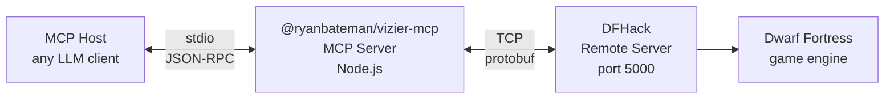

<p align="center">
  
</p>

# Vizier MCP

Vizier is an MCP server/AI integration for Dwarf fortress that allows you to query the state of your ongoing game. It allows your LLM agent to act like a vizier - giving you a helpful assistant to ask about your dwarfs and their world - whether your legendary weaponsmith is accidentally assigned to hauling stone, what your world looks like, what your expedition leader is skilled in, and more.  

Similar to Dwarf Therapist, its intended as a read-only interface to help understand your world. And when it comes to terrible, potentially incorrect, treacherous advice that may come at a world-ending price, what better source than ~~AI~~ your trusted Vizier? Ahaha. Ha. Ha.

## Uses

The goal of Vizier is to help a user understand what is happening in their fortress more easily (much like, you know, a real Vizier.) The Vizier only *reads* your game - it doesn't play or affect the gameplay, in part due to limitations in its design, in part through design choice. Below are some example questions you could ask your LLM (but I have been discovering more as I play and would welcome some examples from others!).

### "Where am I, and who do I have to work with?"

*"Of course, my lord. Let us take stock before the next disaster takes stock of us."*

`get_fortress_overview` is the single call that fits on a postcard: the world's name and game mode, your embark in tiles and the depth of stone beneath it, your civilisation/site identifiers, and a tally of every dwarf — their professions in a histogram, the gender split, and a list of the genuinely skilled (any soul above journeyman level). It is the natural opener; from there `list_units` (try `summary:true` for a roster) and `get_unit` will tell you everything the overview only hinted at.

### "A forgotten beast claws at the gate. Describe it."

*"Of course, my lord. Let us see what crawled up from the dark to end us this time."*

Ask the Vizier to find the creature by name or sweep the region it lurks in — `get_unit` (by name) or `get_unit_list_inside` (a bounding box around your gate). Back comes its body, size, age, anything it's wearing or wielding, and any wounds it already carries. Pair it with `get_reference_data kind=creature_raws` and the Vizier will recite the species' body parts, attacks, and what it's *made of* — so you know whether your axedwarves or your prayers stand a better chance.

### "What are those accursed things the bards are playing?"

*"A terrible set of contraptions, my liege, none of which the wretches play well."*

Every world dreams up its own instruments — their names, their parts, and the unholy ways they are sounded. `get_reference_data kind=item_types` is the full item catalogue; the Vizier sifts it for the entries that carry an `instrument` block and reports each one's name, its named `pieces` (the bits that warp, snap, or go missing), its `description`, its size and `value`, the pitch and volume range it can inflict, and *how* it is played — plucked, bowed, blown over a reed, or struck until it stops.

### "The siege is broken. Describe the injuries my militia took."

*"Bring me the rolls of the wounded. And the rolls of the no-longer-anything."*

Triage with `list_units` (filter `alive` / `dead`), then `get_unit` each survivor. The Vizier reports each one's `wounds` (which body part, which layer), their blood level (`blood_count` vs `blood_max` — watch for the ones bleeding out), and exactly what armour was — or catastrophically *wasn't* — between them and the goblin's blade.

### "Tell me of my expedition leader - are they fit to lead?"

*"A wise ruler knows their second-wisest advisor."*

`get_unit` by name returns their identity, race, age, noble position(s) (Expedition Leader, later Mayor or Baron), and a fully itemised account of what they're wearing — every sock, with its material named. Add `list_units` with `mask: { profession: true, skills: true }` and the Vizier will also tell you their profession and exactly how good they are at the things they claim to be good at.

### "Is the militia actually ready?"

*"'Ready' is such an optimistic word, my lord. Let us check."*

`list_squads` gives rosters, leaders, and weapon assignments. `list_units` with `mask.skills` reveals who can actually *fight* versus who is holding an axe hopefully. Then `get_unit` (or `list_units` with `include_inventory`) shows who is genuinely armoured and armed — and who marched out in a dress.

### "Root out the Bard epidemic."

*"Eleven bards. One fortress. No food. A familiar tragedy."*

`list_units` with `mask: { profession: true, skills: true, labors: true }` lays bare the whole workforce: profession distribution, who is a *legendary* miner currently assigned to hauling rocks, and every labor/skill mismatch keeping your fortress poor and over-serenaded. This is great for seeing where you are under-utilising specialists or where you can redistribute generalists. 

### "Read the world, and the ground beneath us."

*"Geomancy is just paying attention, my lord."*

`get_world_info` (save, civilisation, mode), `get_map_info` (dimensions, embark, z-levels), and `get_block_list` (terrain, tiles, and materials for any region) map your holdings. `get_reference_data` (`materials`, `plant_raws`, `building_defs`) tells you what you can dig, grow, brew, and build here.

> Vizier reports only what DFHack will tell it. Current jobs, moods, stress, relationships and legends are not visible (see [the RunLua appendix](#appendix-why-runlua-is-blocked)). There is, of course, a good chance that the ~~AI~~ your trusted Vizier will lie and say that there is. Ahaha.

## Quickstart

### Prerequisites

To start, you will need a running Dwarf Fortress game with DFHack and its remote server enabled. Check `dfhack-config/remote-server.json` and you should see something like this:

```json
{ "allow_remote": false, "port": 5000 }
```

Vizier and/or your AI agent will need to run on the same machine as DFHack. If you want to run it elsewhere, set `"allow_remote": true` in the config, but note that if DF runs on a different machine from the agent you will see more limited functionality (see [Remote Access](#remote-access)).

### MCP client configuration

Vizier reads `DFHACK_HOST` (default `127.0.0.1`) and `DFHACK_PORT` (default `5000`) from the environment. **Claude Desktop** (`~/Library/Application Support/Claude/claude_desktop_config.json`) — **Cursor** (`.cursor/mcp.json`) uses the identical `mcpServers` shape:

```json
{
  "mcpServers": {
    "vizier": {
      "command": "npx",
      "args": ["@ryanbateman/vizier-mcp"],
      "env": { "DFHACK_HOST": "127.0.0.1", "DFHACK_PORT": "5000" }
    }
  }
}
```

**OpenCode** (`.opencode/opencode.json`) uses its own shape:

```jsonc
{
  "mcp": {
    "vizier": {
      "type": "local",
      "command": ["npx", "@ryanbateman/vizier-mcp"],
      "enabled": true,
      "environment": { "DFHACK_HOST": "127.0.0.1", "DFHACK_PORT": "5000" }
    }
  }
}
```

> **From source:** replace `"command"/"args"` with `["node", "/path/to/vizier_mcp/build/index.js"]`.


### Manual Install

```bash
npx @ryanbateman/vizier-mcp
```

Or from source:

```bash
git clone https://github.com/ryanbateman/vizier_mcp.git
cd vizier_mcp
npm ci && npm run build
node build/index.js
```

## Tool Reference

### Core API tools

| Tool | Description | Key Parameters |
|------|-------------|---------------|
| `get_version` | DFHack version | — |
| `get_df_version` | Dwarf Fortress version | — |
| `get_world_info` | Save dir, game mode, civ/site IDs (no numeric world id) | — |
| `get_reference_data` | **All static reference data**, cached per save (materials, item types, enums, job skills, creature/plant raws, building defs, tiletypes, language) | `kind`, `type`, `offset`, `limit` |
| `list_enums` | Alias for `get_reference_data kind=enums` | — |
| `list_job_skills` | Alias for `get_reference_data kind=job_skills` | `type`, `offset`, `limit` |
| `list_materials` | Live *filtered* material query (not the static dump) | `inorganic`, `builtin`, `creatures`, `plants`, `offset`, `limit` |
| `list_units` | Units with filters and data mask | `scan_all`, `race`, `civ_id`, `name`, `mask`, `include_inventory`, `offset`, `limit` |
| `list_squads` | Military squads and members | — |
| `set_unit_labors` | Enable/disable labors per unit | `changes[]` |

### RemoteFortressReader (RFR) tools

| Tool | Description | Key Parameters |
|------|-------------|---------------|
| `get_unit` | A single fully-enriched unit by `id` or `name`, incl. inventory and noble positions (backed by RFR `GetUnitList`) | `id`, `name` |
| `get_unit_list` | Full unit data with inventory and appearance | — |
| `get_unit_list_inside` | Units within a region | `minX`, `minY`, `minZ`, `maxX`, `maxY`, `maxZ` |
| `get_block_list` | Map tile and terrain data | `minX`, `minY`, `minZ`, `maxX`, `maxY`, `maxZ` |
| `get_map_info` | Map dimensions and embark position | — |
| `get_view_info` | Current viewport position and size | — |
| `get_pause_state` | Whether the game is paused | — |

### Reference data: tool + resources

Static game reference data is cached per save and exposed two ways so the model rarely needs a repeat call:

- **Tool:** `get_reference_data({ kind, type?, offset?, limit? })` — `kind` ∈ `materials`, `item_types`, `enums`, `job_skills`, `creature_raws`, `plant_raws`, `building_defs`, `tiletypes`, `language`.
- **Resources:** each dataset is also an MCP resource (`vizier://reference/materials`, `vizier://reference/job-skills`, …) that capable clients read once and cache.

Unit and item responses (`get_unit`, `list_units`, `get_unit_list`, …) already have profession, skill, labor, flag, race, material and item **names resolved server-side**, so you usually do not need a reference call just to decode IDs. The cache hits DFHack at most once per save (revalidated at most once per 60s, dropped on reconnect).

### `list_units` detail mask

Adding `mask` returns richer data with human-readable names resolved from DFHack's own enums at runtime:

```json
{
  "profession": 114,
  "professionName": "Bard",
  "skills": [{ "id": 117, "level": 8, "name": "Music", "nameNoun": "Musician" }],
  "labors": [{ "id": 11, "name": "Carpentry" }]
}
```

| Mask Field | Returns | Extra Fields |
|-----------|---------|-------------|
| `profession` | Profession ID, squad assignment | `professionName` |
| `skills` | All skill levels and experience | `name`, `nameNoun` per skill |
| `labors` | Enabled labors | `name` per labor |
| `miscTraits` | Personality traits | — |

**Name search:** filter units by case-insensitive substring across first/last/English/nickname, e.g. `list_units({ scan_all: true, name: "besmar", mask: { profession: true } })`.

**Pagination:** `list_units`, `list_materials`, `list_job_skills`, and `get_reference_data` accept `offset`/`limit` and return `{ total, offset, limit, items: [...] }`.

### Core vs RFR unit data

| Data | Core `list_units` | RFR `get_unit` / `get_unit_list` |
|------|:---:|:---:|
| Name, race, gender, civ | ✓ | ✓ |
| Grid-level position | ✓ | ✓ |
| Sub-tile position / facing | ✗ | ✓ |
| Profession (name-resolved) | ✓ | ✓ |
| Skills (level, experience) | mask | ✗ |
| Enabled labors | mask | ✗ |
| Personality traits | mask | ✗ |
| Age / appearance / body size | ✗ | ✓ |
| Full inventory (item, material, slot) | ✗ | ✓ |
| Wounds, blood level | ✗ | ✓ |
| Noble titles (Expedition Leader, Baron, …) | ✗ | ✓ |

### Remote access

When DF runs on a different machine to the agent, DFHack restricts some methods via a per-method `SF_ALLOW_REMOTE` flag. Remote connections also require `"allow_remote": true` in `dfhack-config/remote-server.json` (otherwise the server binds only to `127.0.0.1`).

| Capability | Local | Remote |
|------------|:-----:|:------:|
| Core tools (units, materials, squads, …) | ✓ | ✓ |
| RFR tools (map info, pause state, raws, …) | ✓ | ✓ |
| Unit inventory, appearance, age (RFR) | ✓ | ✓ |
| Map tiles and terrain (RFR) | ✓ | ✓ |
| RunCommand (DFHack console commands) | ✓ | ✗ |
| RunLua (arbitrary Lua queries) | ✗* | ✗* |

\* RunLua is additionally gated even locally — see [the appendix](#appendix-why-runlua-is-blocked).

### Architecture



## Appendix: Why RunLua Is Blocked

`RunLua` — the most powerful tool, giving arbitrary Lua access to the entire game state — is blocked by two independent restrictions in the DFHack source. Neither is fixable from the Vizier side. The restrictions make sense - arbitrarily accessing Lua Runtimes is something only the most foolish of Viziers would allow - but it somewhat restricts what this MCP server is capable of.

### 1. The `SF_ALLOW_REMOTE` permission flag

Every method registered with the remote server carries a set of flags (`SF_ALLOW_REMOTE = 4` in the `ServerFunctionFlags` enum). Methods without `SF_ALLOW_REMOTE` are rejected for non-localhost clients. The check lives in [`RemoteServer.cpp`](https://github.com/DFHack/dfhack/blob/e53187c8b975f71c5c356d9a587563009684bc89/library/RemoteServer.cpp#L264-L267):

```cpp
if (((fn->flags & SF_ALLOW_REMOTE) != SF_ALLOW_REMOTE) &&
    strcmp(socket->GetClientAddr(), "127.0.0.1") != 0)
{
    stream.printerr("In call to {}: forbidden host: {}\n", fn->name, socket->GetClientAddr());
```

`RunLua` is registered without this flag in [`RemoteTools.cpp`](https://github.com/DFHack/dfhack/blob/e53187c8b975f71c5c356d9a587563009684bc89/library/RemoteTools.cpp#L554):

```cpp
addFunction("RunLua", &CoreService::RunLua);  // no SF_ALLOW_REMOTE
```

Compare to a working method on the line above: `addFunction("GetWorldInfo", GetWorldInfo, SF_ALLOW_REMOTE);`.

### 2. The module name gate

Even on localhost, `RunLua` requires the module name to match a whitelist pattern. The gate is in [`RemoteTools.cpp`](https://github.com/DFHack/dfhack/blob/e53187c8b975f71c5c356d9a587563009684bc89/library/RemoteTools.cpp#L636-L651):

```cpp
if (!valid) {
    args.rv = CR_WRONG_USAGE;
    out.printerr("Only modules named rpc.* or *.rpc or *-rpc may be called.\n");
    return 0;
}
```

Only module *names* matching `rpc.*`, `*.rpc`, or `*-rpc` are accepted. Calling `dfhack.internal.getVersion` or any other built-in function is rejected because its name fails this pattern — so RunLua only works against a purpose-written module whose name matches (conventionally a script under `hack/scripts/rpc/`, called as `module: "rpc.mymodule"`).

### What RunLua (or a clean API) could unlock

| Currently Impossible | RunLua Would Enable |
|---------------------|---------------------|
| Current jobs (idle, mining, hauling) | `df.global.world.jobs.list` |
| Mood, stress, personality traits | `unit.status.misc_traits`, `unit.status.current_soul.personality` |
| Legends and history | `dfhack.legends` module |
| Burrow assignments | `unit.burrows` |
| Relationships | `unit.relationships` |

Noble titles and inventory are available via the RFR `get_unit` / `get_unit_list` tools. Wounds and blood level (`UnitDefinition.wounds`, `blood_count`/`blood_max`) are also already exposed there — only mood, stress and personality require RunLua.

> **Could the curtain be lifted?** Legends and history *are* reachable in principle — see [UNLOCKING-LEGENDS.md](UNLOCKING-LEGENDS.md) for a short feasibility note on two routes (a small Lua companion that works today on localhost, and a small DFHack source fork that would do it properly).

Because of the above, the `run_lua` tool is **disabled by default** — exposing a tool that only works with bespoke `rpc.*` modules just leads models to attempt it and fail. Enable it only if you have authored such modules: set `VIZIER_ENABLE_RUN_LUA=1`. Even when enabled, Vizier validates the module name client-side and rejects anything that isn't `rpc.*` / `*.rpc` / `*-rpc` before contacting DFHack.

## Environment Variables

| Variable | Default | Description |
|----------|---------|-------------|
| `DFHACK_HOST` | `127.0.0.1` | DFHack remote server host |
| `DFHACK_PORT` | `5000` | DFHack remote server port |
| `DFHACK_RPC_TIMEOUT_MS` | `60000` | Per-RPC timeout. Raise it for very large fortresses (a slow `get_unit_list`/`get_block_list` can legitimately take a while); on timeout the connection is reset and the next call reconnects. |
| `VIZIER_ENABLE_RUN_LUA` | _(unset)_ | Set to `1`/`true`/`yes` to register the `run_lua` tool. Disabled by default — only useful with user-authored `rpc.*` DFHack modules (see appendix). |

## Troubleshooting

**`Concurrent RPC call attempted — only one call allowed at a time`** — RPC
serialization has been built in since **v0.2.0**, so this error means an
**old build is running**. On startup the server logs its version to stderr:

```
[vizier-mcp] v0.2.x ready (DFHACK_HOST=… DFHACK_PORT=… DFHACK_RPC_TIMEOUT_MS=…)
```

If that line is missing or shows a pre-0.2.x version, your client is on a
stale copy. Fixes: pin `@ryanbateman/vizier-mcp@latest` in the MCP config,
clear the npx cache (`npx clear-npx-cache`), or rebuild a local checkout
(`npm ci && npm run build`).

## Development

Local setup, the build/test loop, and the release process live in
[DEVELOPMENT.md](DEVELOPMENT.md).

## License

MIT
