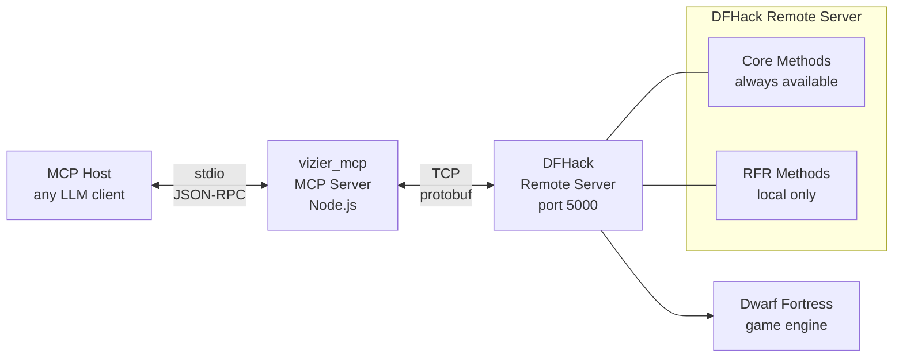

# Vizier MCP

An MCP server that lets an LLM understand what's happening in your Dwarf Fortress game. Connect it to DFHack's remote API and ask questions about your fortress — who lives there, what they're wearing, whether your legendary weaponsmith has been assigned to hauling stone, what the map looks like, and more.

## What You Can Do

When running on the same machine as DF (the typical setup), Vizier has near-complete read access to your game. Here are real examples of what you can ask:

### Workforce

| Question | Tool | What You See |
|----------|------|-------------|
| "What's my population?" | `list_units` | 174 dwarves with names, professions, positions |
| "Count my Bards vs Poets" | `list_units` with `mask.profession` | 27 Bards, 18 Poets |
| "Who's my best miner?" | `list_units` with `mask.skills` | Reg Wavedringed, Mining level 28 |
| "Find a specific dwarf" | `list_units` with `name` | Substring search across all names |
| "Show every labor/skill mismatch" | Compare skills to enabled labors | nish Bentglove has Surgery 10 but SURGERY labor off |
| "What are my dwarves wearing?" | `get_unit_list` (RFR) | Full inventory: item type, material quality, body slot |
| "List my military squads" | `list_squads` | 4 squads with leaders and rosters |
| "What labors do dwarves have?" | `list_enums`, `list_job_skills` | Every labor, skill, profession with IDs and names |

### World & Materials

| Question | Tool | What You See |
|----------|------|-------------|
| "What world is this?" | `get_world_info` | "The Universes of Vision", Dwarf Mode |
| "What materials are here?" | `list_materials` | 319 inorganic materials, iron through adamantine |
| "Show me a creature's raw stats" | `get_creature_raws` (RFR) | Body parts, attacks, materials for every creature |
| "What plants grow here?" | `get_plant_raws` (RFR) | Every plant, growths, products, seasons |
| "List all building types" | `get_building_def_list` (RFR) | Workshop, furnace, trap definitions |
| "What musical instruments exist?" | `get_item_list` (RFR) | 29 instruments with materials, ranges, and sound descriptions |

### Map & Position

| Question | Tool | What You See |
|----------|------|-------------|
| "What does the map look like?" | `get_block_list` (RFR) | Tile types, terrain, materials for any region |
| "Where's my camera?" | `get_view_info` (RFR) | Current viewport position and size |
| "Is the game paused?" | `get_pause_state` (RFR) | true / false |
| "What are the map dimensions?" | `get_map_info` (RFR) | Block count, embark position, z-levels |

### Data Detail: Core vs RFR

Two APIs serve unit data. The Core API provides a workforce overview; the RFR API adds rich per-unit detail:

| Data | Core `list_units` | RFR `get_unit_list` |
|------|:---:|:---:|
| Name, race, gender, civ | ✓ | ✓ |
| Grid-level position | ✓ | ✓ |
| Sub-tile position (fractional) | ✗ | ✓ |
| Facing direction | ✗ | ✓ |
| Profession (with name resolution) | ✓ | ✓ |
| Profession display color | ✗ | ✓ |
| Skills (level, experience) | mask | ✓ |
| Enabled labors | mask | ✗ |
| Personality traits | mask | ✗ |
| Age in years | ✗ | ✓ |
| Physical appearance (hair, beard, colors) | ✗ | ✓ |
| Body size | ✗ | ✓ |
| Full inventory (every item, material, slot) | ✗ | ✓ |
| Mounted/riding status | ✗ | ✓ |
| Noble titles (Expedition Leader, Baron, Count, etc.) | ✗ | ✓ |

## If You're Connecting Remotely

When DF runs on a different machine, access is reduced. DFHack's remote server applies a per-method `SF_ALLOW_REMOTE` permission flag. Methods without it are rejected for non-localhost clients. The table below shows exactly what works where.

| Data | Local | Remote |
|------|:-----:|:------:|
| Core tools (units, materials, squads, etc.) | ✓ | ✓ |
| Map info, pause state, creature/plant raws | ✓ | ✗ |
| Unit inventory, appearance, age | ✓ | ✗ |
| Map tiles and terrain | ✓ | ✗ |
| RunLua (arbitrary Lua queries) | ✗* | ✗* |

\**RunLua has an additional module name restriction even locally. See [Why RunLua Is Blocked](#why-runlua-is-blocked).*

To unlock everything remotely, add `SF_ALLOW_REMOTE` to the blocked methods in DFHack's source and rebuild, or run a proxy on the DF host (e.g. `websockify`) to make remote clients appear as localhost.

## Architecture



## Setup

```bash
npm install
npm run build
```

Configure your MCP host. The server reads `DFHACK_HOST` and `DFHACK_PORT` from environment variables:

```jsonc
{
  "mcp": {
    "vizier": {
      "type": "local",
      "command": ["node", "/path/to/vizier_mcp/build/index.js"],
      "enabled": true,
      "environment": {
        "DFHACK_HOST": "127.0.0.1",
        "DFHACK_PORT": "5000"
      }
    }
  }
}
```

> **Note for OpenCode users:** Use `environment` not `env` — OpenCode's config schema requires the full `environment` key. Other MCP hosts may use `env`.

## Tools

### Always Available (Core API)

| Tool | Description | Key Parameters |
|------|-------------|---------------|
| `get_version` | DFHack version | — |
| `get_df_version` | Dwarf Fortress version | — |
| `get_world_info` | World name, game mode, IDs | — |
| `list_enums` | Labor, skill, profession enums | — |
| `list_job_skills` | Skills, professions, and labors | `type`, `offset`, `limit` |
| `list_materials` | Materials (stone, metal, gem, etc.) | `inorganic`, `builtin`, `creatures`, `plants`, `offset`, `limit` |
| `list_units` | Units with filters and data mask | `scan_all`, `race`, `civ_id`, `name`, `mask`, `offset`, `limit` |
| `list_squads` | Military squads and members | — |
| `set_unit_labors` | Enable/disable labors per unit | `changes[]` |

### Local Only (RFR API)

| Tool | Description | Key Parameters |
|------|-------------|---------------|
| `get_unit_list` | Full unit data with inventory and appearance | — |
| `get_unit_list_inside` | Units within a region | `minX`, `minY`, `minZ`, `maxX`, `maxY`, `maxZ` |
| `get_block_list` | Map tile and terrain data | `minX`, `minY`, `minZ`, `maxX`, `maxY`, `maxZ` |
| `get_map_info` | Map dimensions and embark position | — |
| `get_view_info` | Current viewport position and size | — |
| `get_pause_state` | Whether the game is paused | — |
| `get_creature_raws` | All creature type definitions | — |
| `get_plant_raws` | All plant type definitions | — |
| `get_building_def_list` | All building type definitions | — |
| `get_item_list` | All item type definitions | — |
| `get_tiletype_list` | All tile type definitions | — |
| `get_language` | Language/translation data | — |
| `get_material_list` | Material definitions (RFR format) | — |

### `list_units` Detail Options

Adding `mask` returns richer data with human-readable names resolved from DFHack's own enums at runtime:

```json
{
  "profession": 114,
  "professionName": "Bard",
  "skills": [{ "id": 117, "level": 8, "name": "Music", "nameNoun": "Musician" }],
  "labors": [{ "id": 11, "name": "Carpentry" }]
}
```

| Mask Field | Returns | Extra Fields |
|-----------|---------|-------------|
| `profession` | Profession ID, squad assignment | `professionName` |
| `skills` | All skill levels and experience | `name`, `nameNoun` per skill |
| `labors` | Enabled labors | `name` per labor |
| `miscTraits` | Personality traits | — |

All name lookups are fetched dynamically from the connected DFHack instance — no hardcoded mappings.

### Name Search

Filter units by substring match across first name, last name, English name, and nickname:

```
list_units({ scan_all: true, name: "besmar", mask: { profession: true } })
```

### Pagination

Large responses from `list_units`, `list_materials`, and `list_job_skills` use `offset`/`limit`:

```json
{ "total": 174, "offset": 0, "limit": 20, "items": [...] }
```

## Why RunLua Is Blocked

`RunLua` — the most powerful tool, giving arbitrary Lua access to the entire game state — is blocked by two independent restrictions in the DFHack source. Neither is fixable from the Vizier side.

### 1. The `SF_ALLOW_REMOTE` permission flag

Every method registered with the remote server carries a set of flags. Methods without `SF_ALLOW_REMOTE` are rejected for non-localhost clients. The check lives at [`RemoteServer.cpp#L257`](https://github.com/DFHack/dfhack/blob/develop/library/RemoteServer.cpp#L257):

```cpp
if (((fn->flags & SF_ALLOW_REMOTE) != SF_ALLOW_REMOTE)
    && strcmp(socket->GetClientAddr(), "127.0.0.1") != 0)
    // rejected
```

`RunLua` is registered without this flag at [`RemoteTools.cpp#L576`](https://github.com/DFHack/dfhack/blob/develop/library/RemoteTools.cpp#L576):

```cpp
addMethod("RunLua", &CoreService::RunLua);  // no flags
```

Compare to a working method: `addFunction("GetWorldInfo", GetWorldInfo, SF_ALLOW_REMOTE)`.

### 2. The module name gate

Even on localhost, `RunLua` requires the module name to match a whitelist pattern. The gate is at [`RemoteTools.cpp#L642`](https://github.com/DFHack/dfhack/blob/develop/library/RemoteTools.cpp#L642):

```cpp
if (!valid) {
    args.rv = CR_WRONG_USAGE;
    out.printerr("Only modules named rpc.* or *.rpc or *-rpc may be called.\n");
}
```

Only `rpc.*`, `*.rpc`, or `*-rpc` module names are accepted. Calling `dfhack.internal.getVersion` or any other built-in function is rejected. To use RunLua, you must create a Lua script at e.g. `hack/scripts/rpc/mymodule.lua` and call it with `module: "rpc.mymodule"`.

### What RunLua Would Unlock

| Currently Impossible | RunLua Would Enable |
|---------------------|---------------------|
| Current jobs (idle, mining, hauling) | `df.global.world.jobs.list` |
| Health, injuries, mood | `unit.status.misc_traits` and `unit.body` |
| Legends and history | `dfhack.legends` module |
| Burrow assignments | `unit.burrows` |
| Relationships | `unit.relationships` |

Noble titles and inventory are already available locally via the RFR `get_unit_list` tool.

## Environment Variables

| Variable | Default | Description |
|----------|---------|-------------|
| `DFHACK_HOST` | `127.0.0.1` | DFHack remote server host |
| `DFHACK_PORT` | `5000` | DFHack remote server port |

## Development

```bash
npm run proto          # regenerate proto JSON from .proto files
npm run build          # full build (proto + tsc)
npm run inspector      # run MCP inspector for debugging
```

## License

ISC
