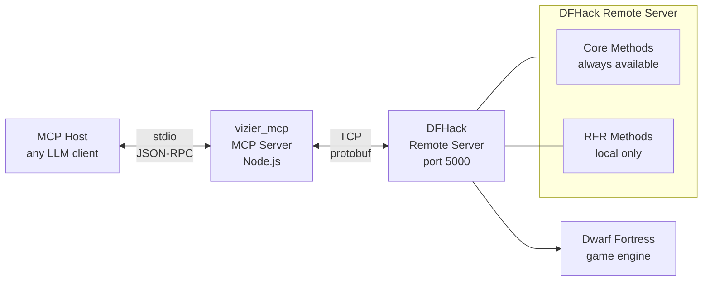

# Vizier MCP

An MCP server that lets an LLM understand what's happening in your Dwarf Fortress game. It connects to DFHack's remote API and exposes tools for querying your fortress state — who lives there, what they're skilled at, whether your legendary weaponsmith has been assigned to hauling stone instead of forging.

## What You Can Do

Ask questions like these and get real, live answers from your running game:

| Question | Tool | What You See |
|----------|------|-------------|
| "What's my fortress population?" | `list_units` | 174 dwarves with names, professions, and positions |
| "Who's my best miner?" | `list_units` with `mask.skills` | Reg Wavedringed, Mining level 28 |
| "Are there any skill/labor mismatches?" | Compare skills to enabled labors | nish Bentglove has Surgery 10 but SURGERY labor is off |
| "Count my Bards vs Poets" | `list_units` with `mask.profession` | 27 Bards, 18 Poets, 3 Dancers |
| "Find a specific dwarf" | `list_units` with `name` | Substring search across all name fields |
| "What materials are on this map?" | `list_materials` | 319 inorganic materials, iron through adamantine |
| "Show me my military squads" | `list_squads` | 4 squads with leader names and member rosters |
| "What labors do my dwarves have?" | `list_enums`, `list_job_skills` | Every labor, skill, and profession with IDs and names |

## Limitations

Vizier can see **what your dwarves are assigned to do** — their skills, enabled labors, squad, profession. It cannot see:

- **What they're doing right now** (mining, hauling, sleeping, idle)
- **Health, mood, stress, injuries**
- **Noble titles** (Count, Mayor — stored as entity positions, not unit data)
- **Inventory, equipment, relationships, burrows**
- **Map tiles, terrain, buildings, items**

These require the RemoteFortressReader plugin or `RunLua`, both of which are blocked for remote connections (see [Why Some Methods Are Blocked](#why-some-methods-are-blocked)). When DF is running locally, many of these are available (see [Local vs Remote Access](#local-vs-remote-access)).

## Architecture



## Setup

```bash
npm install
npm run build
```

Configure your MCP host:

```jsonc
{
  "mcp": {
    "vizier": {
      "type": "local",
      "command": ["node", "/path/to/vizier_mcp/build/index.js"],
      "enabled": true,
      "environment": {
        "DFHACK_HOST": "127.0.0.1",
        "DFHACK_PORT": "5000"
      }
    }
  }
}
```

(For OpenCode specifically, use `environment` not `env` — OpenCode's schema requires the full `environment` key.)

## Tools

### Always Available (Core API)

| Tool | Description | Key Parameters |
|------|-------------|---------------|
| `get_version` | DFHack version | — |
| `get_df_version` | Dwarf Fortress version | — |
| `get_world_info` | World name, game mode, IDs | — |
| `list_enums` | Labor, skill, profession enums | — |
| `list_job_skills` | Skills, professions, and labors | `type`, `offset`, `limit` |
| `list_materials` | Materials (stone, metal, gem, etc.) | `inorganic`, `builtin`, `creatures`, `plants`, `offset`, `limit` |
| `list_units` | Units with filters and data mask | `scan_all`, `race`, `civ_id`, `name`, `mask`, `offset`, `limit` |
| `list_squads` | Military squads and members | — |
| `set_unit_labors` | Enable/disable labors per unit | `changes[]` |

### `list_units` Detail Options

Adding `mask` returns richer data with human-readable names resolved from DFHack's own enums at runtime:

```json
{
  "profession": 114,
  "professionName": "Bard",
  "skills": [{ "id": 117, "level": 8, "name": "Music", "nameNoun": "Musician" }],
  "labors": [{ "id": 11, "name": "Carpentry" }]
}
```

| Mask Field | Returns | Extra Fields |
|-----------|---------|-------------|
| `profession` | Profession ID, squad assignment | `professionName` |
| `skills` | All skill levels and experience | `name`, `nameNoun` per skill |
| `labors` | Enabled labors | `name` per labor |
| `miscTraits` | Personality traits | — |

All name lookups are fetched dynamically from the connected DFHack instance — no hardcoded mappings.

### Name Search

Filter units by substring match across first name, last name, English name, and nickname:

```
list_units({ scan_all: true, name: "besmar", mask: { profession: true } })
```

### Pagination

Large responses from `list_units`, `list_materials`, and `list_job_skills` use `offset`/`limit`:

```json
{ "total": 174, "offset": 0, "limit": 20, "items": [...] }
```

## Why Some Methods Are Blocked

DFHack's remote server has two independent restrictions that prevent full game access from a remote connection.

### 1. The `SF_ALLOW_REMOTE` permission flag

Every RPC method is registered with a set of flags. Methods without `SF_ALLOW_REMOTE` are rejected if the client connects from anything other than `127.0.0.1`.

The permission check lives at [`RemoteServer.cpp#L257`](https://github.com/DFHack/dfhack/blob/develop/library/RemoteServer.cpp#L257):

```cpp
if (((fn->flags & SF_ALLOW_REMOTE) != SF_ALLOW_REMOTE)
    && strcmp(socket->GetClientAddr(), "127.0.0.1") != 0)
    // rejected
```

The methods that are blocked were registered without the flag in [`RemoteTools.cpp`](https://github.com/DFHack/dfhack/blob/develop/library/RemoteTools.cpp):

- `RunLua` at [#L576](https://github.com/DFHack/dfhack/blob/develop/library/RemoteTools.cpp#L576) — no flags
- `RunCommand` at [#L574](https://github.com/DFHack/dfhack/blob/develop/library/RemoteTools.cpp#L574) — `SF_DONT_SUSPEND` only
- All RFR plugin methods inherit whatever flags the plugin registers

Compare to `GetWorldInfo`, which works: `addFunction("GetWorldInfo", GetWorldInfo, SF_ALLOW_REMOTE)`.

### 2. The RunLua module name gate

Even on localhost, `RunLua` has an additional restriction at [`RemoteTools.cpp#L642`](https://github.com/DFHack/dfhack/blob/develop/library/RemoteTools.cpp#L642). Only modules matching `rpc.*`, `*.rpc`, or `*-rpc` are accepted:

```cpp
if (!valid) {
    args.rv = CR_WRONG_USAGE;
    out.printerr("Only modules named rpc.* or *.rpc or *-rpc may be called.\n");
    return 0;
}
```

This means calling `dfhack.internal.getVersion` or any other built-in Lua function is rejected. To use RunLua, you must create a Lua script at e.g. `hack/scripts/rpc/mymodule.lua` and call it with `module: "rpc.mymodule"`.

### Blocked Method Summary

| Method | Provides | Restriction |
|--------|----------|-------------|
| `GetUnitList` | Full unit data with inventory and appearance | SF_ALLOW_REMOTE |
| `GetBlockList` | Map tile and terrain data | SF_ALLOW_REMOTE |
| `GetMapInfo` | Map dimensions | SF_ALLOW_REMOTE |
| `GetPauseState` | Game pause state | SF_ALLOW_REMOTE |
| `GetBuildingDefList` | Building definitions | SF_ALLOW_REMOTE |
| `GetCreatureRaws` | Creature definitions | SF_ALLOW_REMOTE |
| `GetPlantRaws` | Plant definitions | SF_ALLOW_REMOTE |
| `GetTiletypeList` | Tile type definitions | SF_ALLOW_REMOTE |
| `RunLua` | Arbitrary Lua queries | SF_ALLOW_REMOTE + module gate |
| `RunCommand` | DFHack console commands | SF_ALLOW_REMOTE |

### Local vs Remote Access

When DF is running on the same machine as the MCP server (`127.0.0.1`):

| Data | Available? |
|------|:----------:|
| All Core tools (units, materials, squads, etc.) | ✓ |
| Map info, pause state, creature/plant raws | ✓ |
| Full unit detail — inventory, appearance, age, sub-tile position | ✓ |
| RunLua | ✗ (module name gate still applies) |

To unlock everything for remote connections, either add `SF_ALLOW_REMOTE` to the blocked methods in DFHack's source and rebuild, or run a proxy on the DF host (e.g. `websockify`) to make remote clients appear as localhost.

## What the Remote Server Exposes

| Available via Core API | Not Available Remotely |
|------------------------|------------------------|
| Version strings (DF + DFHack) | Map tile/block data |
| World name, game mode, world ID | Unit current jobs and activity |
| Unit names, positions, races, civ | Unit health, injuries, mood, stress |
| Profession with human-readable names | Noble titles (entity positions) |
| Skill levels and experience | Equipment and inventory |
| Enabled labors per unit | Relationships and family |
| Personality traits | Burrow assignments |
| Military squad rosters | Game pause state |
| All material definitions | Building/item/creature/plant definitions |
| Enum definitions (labors, skills, etc.) | Lua queries (`RunLua`) |
| Name search on units | Console commands (`RunCommand`) |

## Environment Variables

| Variable | Default | Description |
|----------|---------|-------------|
| `DFHACK_HOST` | `127.0.0.1` | DFHack remote server host |
| `DFHACK_PORT` | `5000` | DFHack remote server port |

## Development

```bash
npm run proto          # regenerate proto JSON from .proto files
npm run build          # full build (proto + tsc)
npm run inspector      # run MCP inspector for debugging
```

## License

ISC
